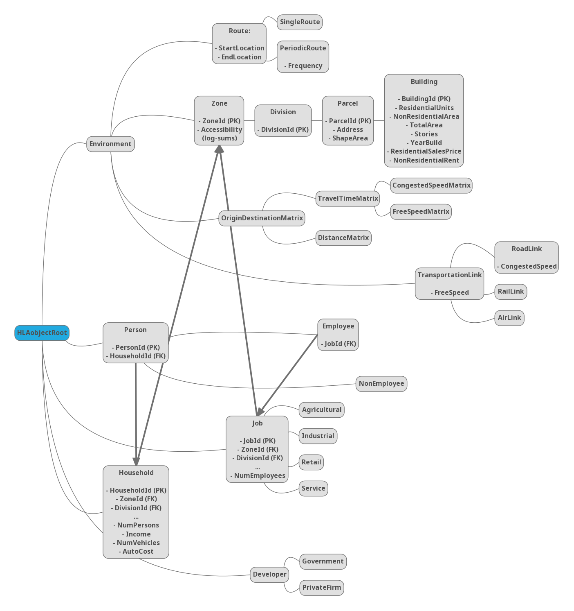

# itlum-fom
Federation Object Model for Integrated Transportation Land Use Models (in ANSS 2018).

This repository contains the most recent version of the FOM proposed in our ANSS 2018 paper (see `ITLUM FOM.feproj`). This file was created with the [MAK FOM Editor](https://www.mak.com/products/link/mak-fom-editor),a tool for viewing/editing Federation Object Models in browser.

## Object Class Structure

Below is a tree view of the Object Class Structure defined in `ITLUM FOM.feproj`.

